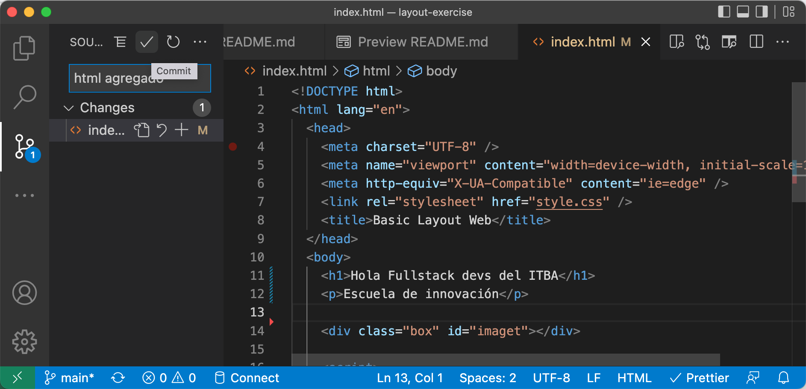

# Ejercicio para un layout básico con display Grid

## Crear una página que se vea así

Figma Link : https://www.figma.com/file/ks3DjmwxTJEpi0jzBvZrEp/Untitled?node-id=1%3A2

## Cómo completar la tarea

- Fork este repositorio
- Luego clonar el repo forkeado

- Crear una carpeta que tenga como nombre a TU nombre de github
- Al terminar tu tarea subir los cambios a tu repo forkeado

- Create Pull Request

- Check your changes

- Describe Your Pull Request on comment, and Pull Request Title `Add Task-1/{{github-username}}`

- Yeayy Done, You're Successfull Completed this task

